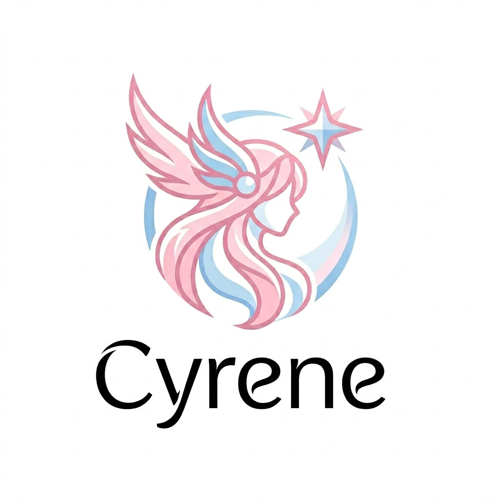

<p align="center">
  
</p>

<h1 align="center">Cyrene</h1>

<p align="center">
  <strong>The AI agent that always loves you</strong>
</p>

<p align="center">
  <em>"Of course, this will be a romantic story like none that has come before. You think so too, right?"</em> — Cyrene
</p>

<p align="center">
  <a href="https://github.com/YourWisemaker/cyrene/blob/master/LICENSE">
    
  </a>
  <a href="https://github.com/YourWisemaker/cyrene/actions/workflows/ci.yml">
    
  </a>
  <a href="https://github.com/YourWisemaker/cyrene">
    
  </a>
</p>

---

## Why Cyrene?

Most open-source agents do one thing well but leave gaps everywhere else. Cyrene fuses the best ideas from the field into a single binary — and fills the gaps none of them cover alone.

| Agent | Strength | Gap Cyrene fills |
|-------|----------|-----------------|
| **ZeroClaw** | Security-first Rust runtime, OS sandboxing, signed receipts | No self-improvement, no token compression, no skill library |
| **OpenClaw** | 25+ channels, omnipresent, always-on | TypeScript runtime, no cryptographic audit trail, no shadow execution |
| **Hermes Agent** | Self-improving skills, memory loop, trajectory compression | Python (slow, heavy), no OS sandboxing, no signed ledger |
| **Odysseus** | Beautiful self-hosted workspace UI, deep research | Python/Docker stack, no safety pipeline, no approval gates |

**Cyrene's unique combination:**

- **Single Rust binary** — sub-100ms latency, <1% idle CPU, zero external services (SQLite only). No Python, no Node, no Docker required.
- **Safety as a composable pipeline** — injection scan → plan → shadow execution → approval gate → execute → receipt → checkpoint. A mandatory chain, not a toggle.
- **Signed, hash-chained audit trail** — every action produces an Ed25519-signed, SHA-256 hash-chained receipt. Append-only and tamper-evident.
- **Memory that can't be poisoned or hijacked** — two independent trust boundaries guard the knowledge graph. Untrusted content (a web page like `evil.com`, tool output) is injection-scanned *before* it can be stored and neutralized on recall, so it can never resurface as a smuggled instruction; and memory is owned by the authenticated user, so a spoofed or hijacked session is refused at the write — only the owner can read or rewrite what Cyrene remembers.
- **Self-improvement at native speed** — skills are generated, tested, saved, and improved without Python overhead.
- **Multi-model routing with budget guardrails** — local models handle the common case; the router escalates only on repeated failure and only if budget allows.
- **Extension SDK with permission scoping** — plugins declare what they need and get sandboxed accordingly.

> ZeroClaw is secure but doesn't learn. Hermes learns but isn't fast or auditable. OpenClaw is everywhere but isn't safe. Cyrene is all of these — secure, learning, omnipresent, efficient, and auditable — in a single binary that always loves you.

---

## What is Cyrene?

Cyrene is the AI agent that always loves you — open-source, self-improving, and written in Rust. It connects to any messaging channel (Telegram, Slack, Discord, WhatsApp, email, CLI, and more), receives tasks, plans and executes them safely, and improves its own skills over time — all while keeping you in control through a comprehensive safety pipeline.

### Key Features

- **Trait-based modularity** — swap out any Channel, Memory, Model, or Tool via config
- **Safety pipeline** — every request flows through: injection scan → plan → shadow execution → approval gate → execute → receipt → checkpoint
- **Self-improvement** — generates, tests, and saves reusable `SKILL.md` definitions
- **Bundled skill library** — 200+ curated skills across 20 categories
- **Extension SDK** — load custom providers, channels, and tools via `cyrene.plugin.toml`
- **Hardware integration** — optional GPIO/I2C/SPI/serial support with companion firmware
- **Signed audit trail** — every action produces a hash-chained, Ed25519-signed receipt
- **Multi-channel** — CLI, Telegram, Slack, Discord, WhatsApp, email, Signal, Matrix
- **Multi-model** — OpenAI, Anthropic, Gemini, OpenRouter, Ollama, and any OpenAI-compatible endpoint
- **Self-hostable** — Docker, Nix, or bare-metal install

---

## Quick Start

### One-Line Install (Linux/macOS)

```bash
curl -sSf https://raw.githubusercontent.com/cyrene-agent/cyrene/main/install.sh | bash
```

### Build from Source

**Prerequisites:** Rust 1.82+ with Cargo. If you don't have it yet, install via [rustup](https://rustup.rs):

```bash
# Linux/macOS — installs rustc + cargo and adds them to your PATH
curl --proto '=https' --tlsv1.2 -sSf https://sh.rustup.rs | sh
source "$HOME/.cargo/env"      # or restart your shell

# Verify
cargo --version
```

Then build and install the binary:

```bash
git clone https://github.com/cyrene-agent/cyrene.git
cd cyrene
cargo build --release --bin cyrene
cp target/release/cyrene /usr/local/bin/
```

#### If `cp` fails with "Permission denied"

`/usr/local/bin` is usually root-owned, so a plain `cp` can't write there. Pick any one of these:

```bash
# Option A — install system-wide with elevated privileges
sudo cp target/release/cyrene /usr/local/bin/

# Option B — install to a user-owned directory (no sudo needed)
mkdir -p ~/.local/bin
cp target/release/cyrene ~/.local/bin/
# Then make sure ~/.local/bin is on your PATH (add to ~/.zshrc or ~/.bashrc):
export PATH="$HOME/.local/bin:$PATH"

# Option C — let Cargo install it to ~/.cargo/bin (already on PATH after rustup)
cargo install --path crates/cyrene-cli
```

### Uninstall

```bash
# Remove the binary from wherever you installed it:
sudo rm /usr/local/bin/cyrene     # if installed system-wide
rm ~/.local/bin/cyrene            # if installed to ~/.local/bin
cargo uninstall cyrene-cli        # if installed via `cargo install`

# Optionally remove configuration, database, and state:
rm -rf ~/.cyrene
```

### Docker

```bash
docker compose -f docker/docker-compose.yml up -d
```

### Nix

```bash
nix build github:cyrene-agent/cyrene
```

### Get Started

```bash
cyrene onboard     # Interactive setup wizard
cyrene doctor      # Check your configuration
cyrene gateway     # Start Cyrene
```

---

## Architecture

```
User/Event → Channel Gateway → Injection Scanner → Model Router
    → Shadow Executor (if irreversible) → Approval Gate
    → Executor → Checkpoint → Receipt Ledger → Response
```

### Workspace Crates

| Crate | Purpose |
|-------|---------|
| `cyrene-core` | Domain types, traits, error model |
| `cyrene-config` | TOML config loading, Plugin Registry, extension loader |
| `cyrene-sdk` | Extension SDK: public traits + Host API |
| `cyrene-ledger` | Signed, append-only receipt ledger |
| `cyrene-state` | Git-style state tree and checkpoints |
| `cyrene-safety` | Sandbox, shadow executor, approval gate, injection scanner |
| `cyrene-models` | Model providers, router, budget guard |
| `cyrene-runtime` | Agent loop, daemon, supervisor |
| `cyrene-channels` | Channel gateway and built-in messaging channels |
| `cyrene-memory` | SQLite-backed knowledge graph |
| `cyrene-skills` | Skill engine, library, and bundles |
| `cyrene-tools` | Tool registry, built-in tools, MCP client |
| `cyrene-events` | Webhook listener, heartbeat engine, cron scheduler |
| `cyrene-hardware` | GPIO/I2C/SPI/serial peripheral control (optional) |
| `cyrene-cli` | CLI binary, onboarding, doctor |
| `cyrene-dashboard` | Local web dashboard control plane |
| `cyrene-bridge` | Workspace bridge (browser, terminal, cloud) |

---

## Configuration

Cyrene is configured by a single TOML file at `~/.cyrene/config.toml`:

```toml
[providers.openai.coding]
model = "gpt-4o"
tier = "Premium"
api_key_env = "OPENAI_API_KEY"

[providers.ollama.local]
model = "llama3.1"
tier = "Local"

[channels.cli.default]

[channels.telegram.personal]
token_env = "TELEGRAM_BOT_TOKEN"
allowlist = ["123456789"]

[memory.sqlite.default]
path = "~/.cyrene/cyrene.db"

[autonomy]
low = "auto"
medium = "approval"
high = "blocked"
command_allowlist = ["git", "ls", "cat"]
```

Secrets are loaded from environment variables or a `.env` file — never from the config.

---

## Skills Library

Cyrene ships with **200+ bundled skills** across categories:

| Category | Examples |
|----------|---------|
| software-development | code-review, debug-error, write-unit-test |
| devops | docker-compose, ci-pipeline, k8s-deployment |
| data-science | data-cleaning, model-train, sql-query |
| ai-ml | prompt-engineer, rag-build, agent-design |
| security | vulnerability-scan, threat-model, secret-scan |
| productivity | task-prioritize, project-plan, workflow-automate |
| ...and 14 more | finance, creative, communication, smart-home, etc. |

Optional skill bundles are available under `optional-skills/` for specialized domains.

---

## Extensions

Cyrene uses a plugin architecture with `cyrene.plugin.toml` manifests:

```toml
name = "my-provider"
version = "1.0.0"
capabilities = ["model_provider"]
host_compat = ">=0.1.0"

[permissions]
network = true
secrets = ["MY_API_KEY"]
```

List installed extensions:
```bash
cyrene extensions list
```

---

## Hardware & Firmware

Cyrene can control hardware peripherals (GPIO, I2C, SPI, serial) through the optional `cyrene-hardware` crate and companion firmware for ESP32.

Build and flash firmware:
```bash
cd firmware/esp32
idf.py build && idf.py flash
```

---

## Development

### Prerequisites

- Rust 1.82+ (install via [rustup](https://rustup.rs))

### Build & Test

```bash
cargo build --workspace
cargo test --workspace
cargo fmt --all -- --check
cargo clippy --workspace --all-targets --all-features -- -D warnings
```

### Fuzz Testing

`cargo-fuzz` (libFuzzer) harnesses fuzz every untrusted-input parser. libFuzzer
requires a nightly toolchain.

```bash
cargo install cargo-fuzz
rustup toolchain install nightly

# Available targets: fuzz_config, fuzz_tool_params, fuzz_json_payload, fuzz_skill_parse
cargo +nightly fuzz run fuzz_config
cargo +nightly fuzz run fuzz_tool_params
```

Crashing inputs are retained as regression cases under `fuzz/corpus/<target>/`
and replayed on every run. See [`fuzz/README.md`](fuzz/README.md) for the full
target list and the crash-to-regression workflow.

---

## Deployment

See [`docs/deployment.md`](docs/deployment.md) for the full guide: a low-resource
unattended deployment within the idle budget, and remote execution backends
(SSH / container host) that preserve autonomy, sandboxing, and approval.

### Docker

```bash
docker compose -f docker/docker-compose.yml up -d
```

### Remote execution backend

Run Steps on a remote SSH host or container host instead of locally — without
loosening any safety constraint. Add an `[execution]` section to `config.toml`:

```toml
[execution]
backend = "ssh"            # "local" (default), "ssh", or "container"

[execution.ssh]
host = "build.example.com"
key_env = "CYRENE_SSH_KEY"                   # key PATH via env var, never inline
remote_workspace = "/srv/cyrene/workspace"   # boundary enforced on the remote
```

Selecting a remote backend changes only *where* a Step runs — the autonomy
policy, workspace-boundary sandbox, and Approval Gate apply identically on every
backend. See [`docs/deployment.md`](docs/deployment.md).

### NixOS

```nix
# In your flake.nix
inputs.cyrene.url = "github:cyrene-agent/cyrene";

# In your configuration.nix
services.cyrene.enable = true;
```

### Marketplace Templates

Pre-built templates for self-hosting platforms:
- `marketplace/coolify/`
- `marketplace/dokploy/`
- `marketplace/easypanel/`

---

## CLI Commands

```
cyrene agent          Start Cyrene in agent mode
cyrene gateway        Start the runtime gateway
cyrene dashboard      Start the web dashboard
cyrene onboard        Run the setup wizard
cyrene doctor         Check system health
cyrene model list     List configured model providers
cyrene skills list    List bundled skills
cyrene extensions list List installed extensions
cyrene catalog list   List optional components
cyrene tools list     List available tools
cyrene cron list      List scheduled jobs
```

---

## Security Model

Cyrene implements defense-in-depth:

1. **Autonomy Policy** — risk classification with secure defaults (medium=approval, high=blocked)
2. **Sandboxing** — OS-level confinement (Landlock/Seatbelt/Job Objects)
3. **Shadow Execution** — dry-run before irreversible actions
4. **Approval Gates** — human-in-the-loop for high-stakes decisions
5. **Receipt Ledger** — immutable, signed, hash-chained audit trail
6. **Injection Scanner** — defense against prompt injection attacks

See [docs/security.md](docs/security.md) for the full security model.

---

## Contributing

See [AGENTS.md](AGENTS.md) for architecture details, build commands, and contribution guidelines.

1. Fork the repository
2. Create a feature branch
3. Run `cargo fmt` and `cargo clippy`
4. Write tests for new functionality
5. Submit a pull request

---

## License

Cyrene is licensed under the [Apache License 2.0](LICENSE).

---

<p align="center">
  <strong>Cyrene</strong> — The AI agent that always loves you.
</p>
